# UAS_SBD

# NAMA : FAJAR ARIF RIYANTO

# KELAS : TI19B2

# NIM : 31191666

# APLIKASI SISTEM PENJUALAN SEDERHANA

# 1. MEMBUAT WEB SEVER DI LINUX DENGAN APACHE2

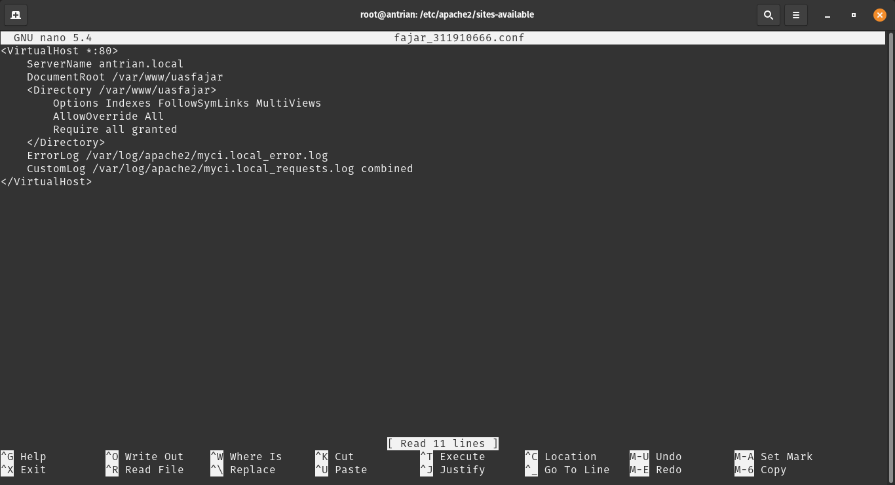

# 2. Desain Database

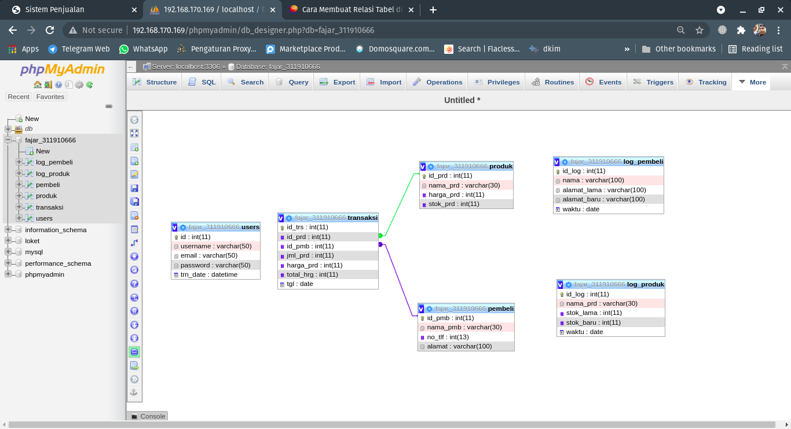

# 3. Tampilan Login, dengan cara mengakses file login.php

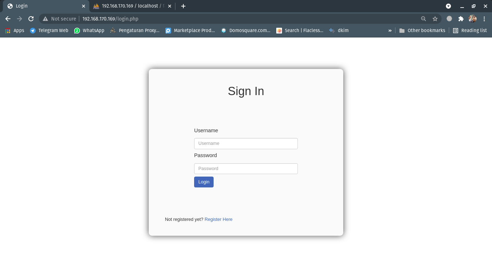)

# 4. Tampilan setelah login, index.php

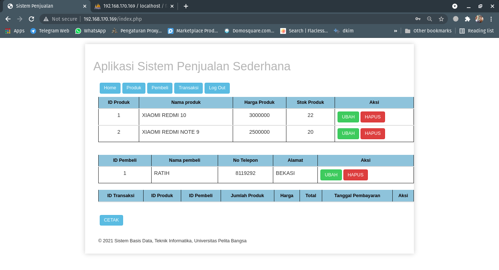

# 5. Tampilan Tabel Produk

# 6. Menambahkan Data
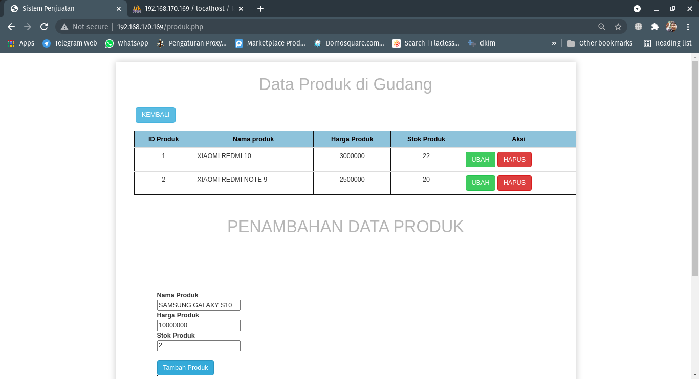
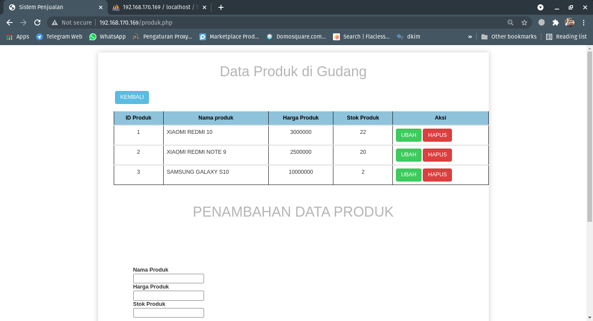

# 7. Menghapus Data

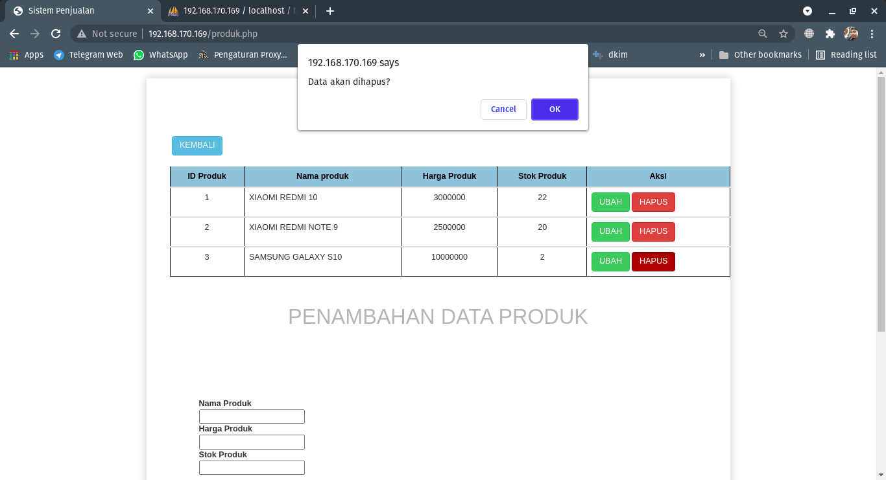

# 8. Mengubah Data
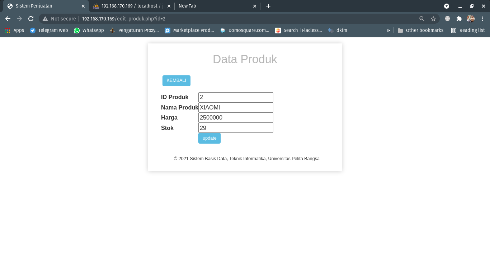

# 8. Membuat Trigger

# Create Trigger dan Table log_produk

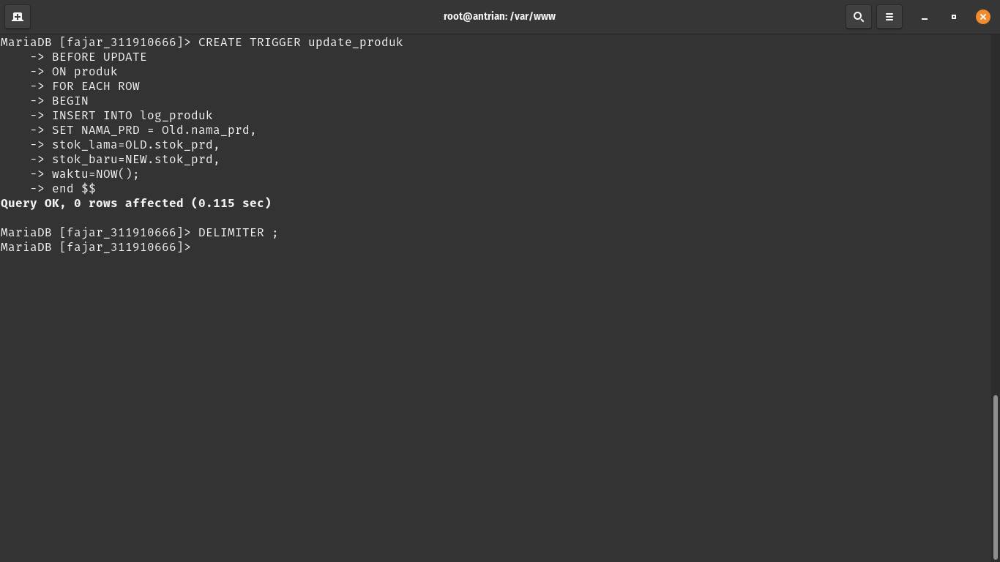

# Create Trigger dan Table log_produk

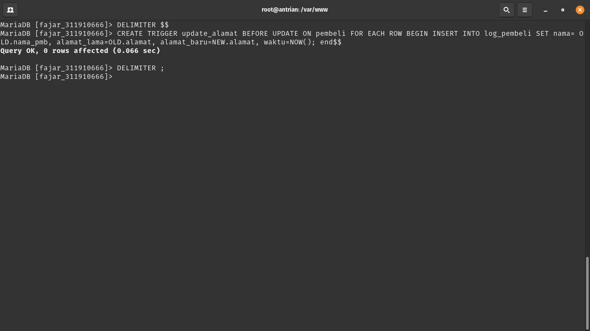

# Update Data

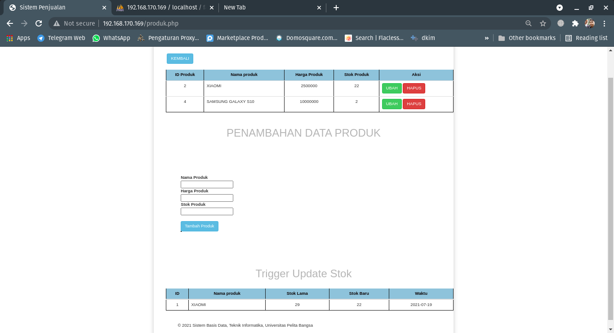

# 9. Log OUt

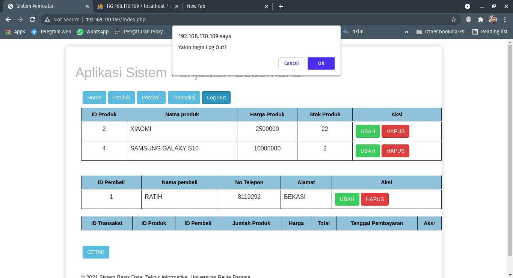

